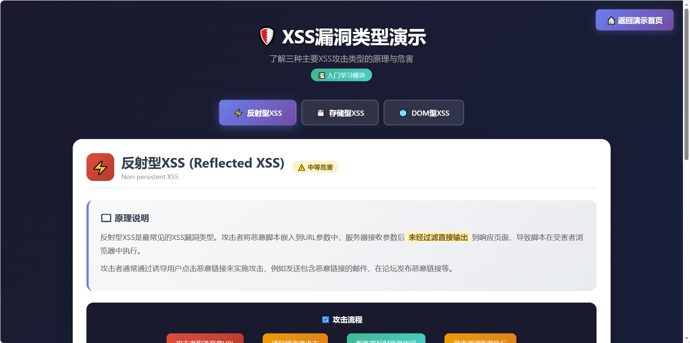
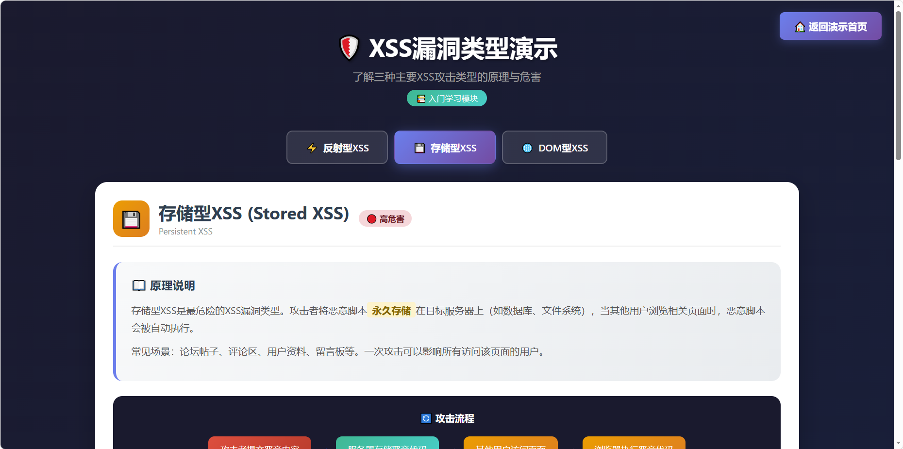
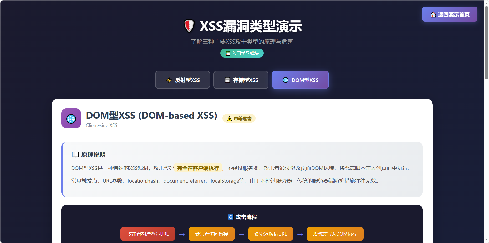
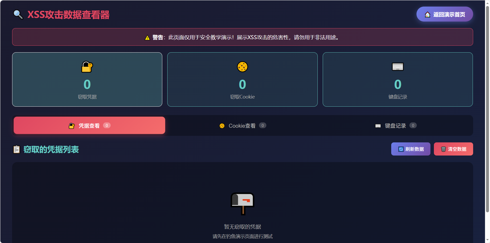
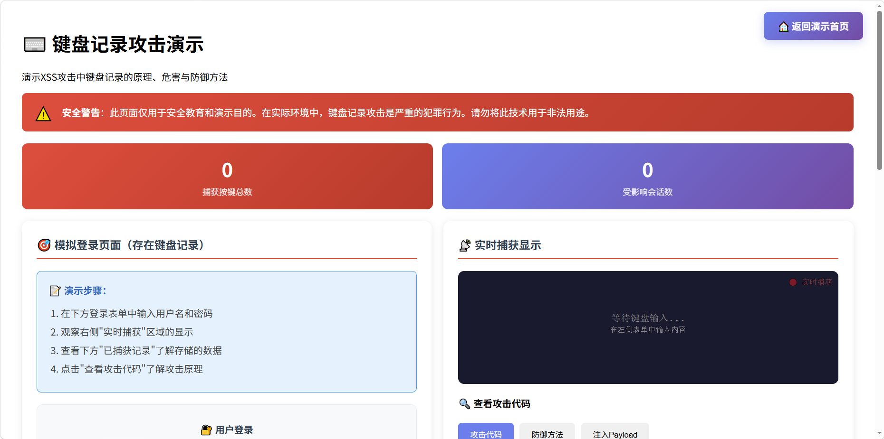
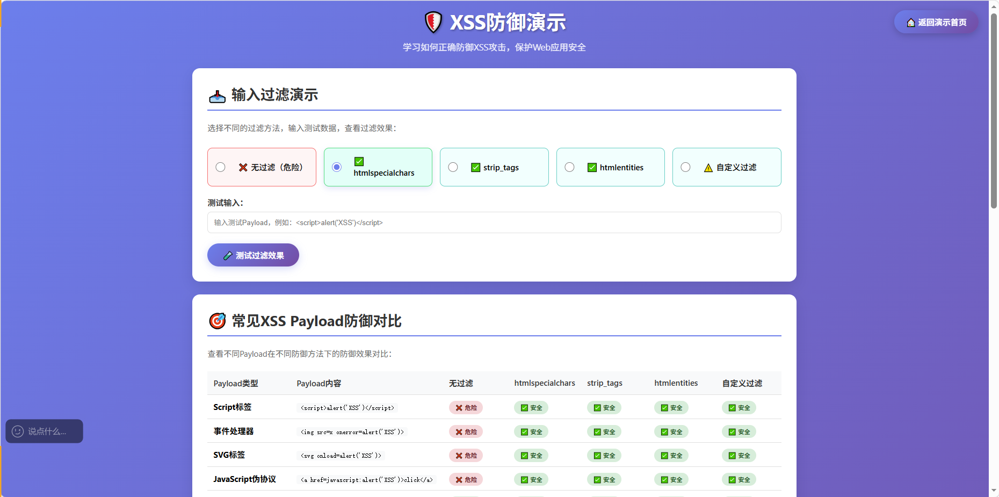
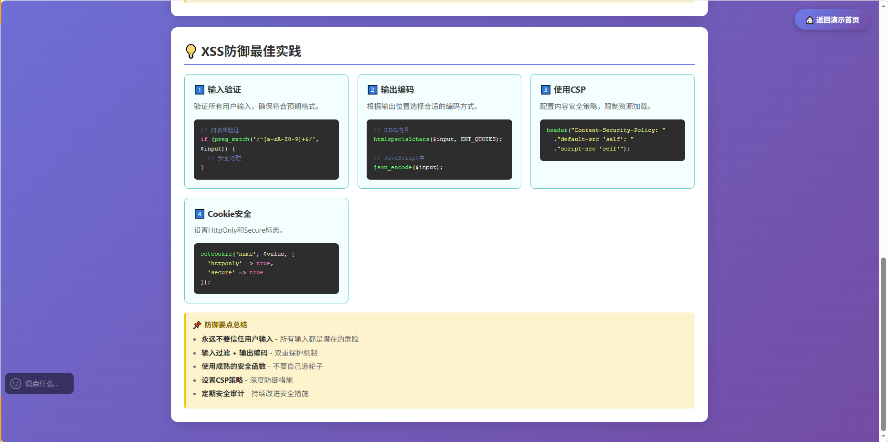
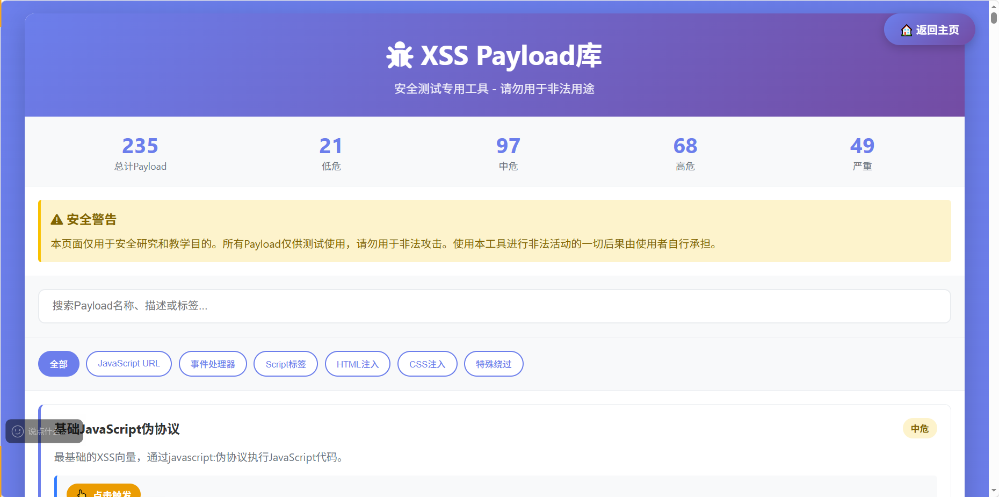
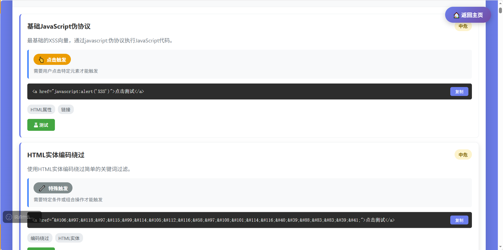
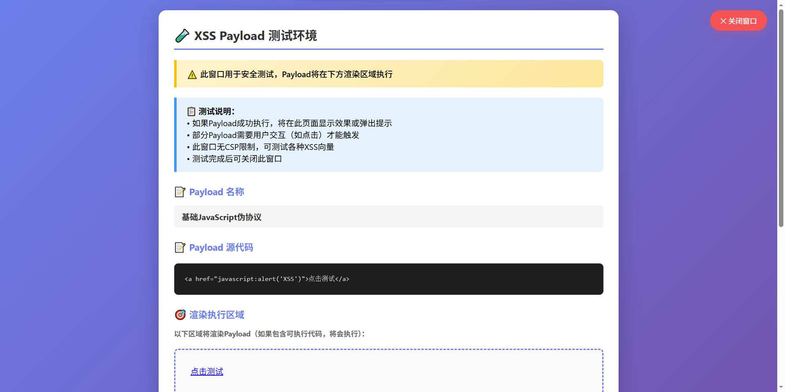

# XSS漏洞演示靶场 🎯

[](LICENSE)
[](https://php.net)
[](docs/SECURITY.md)
[](payload_library.php)

> ⚠️ **警告**：本项目仅用于安全教学和研究目的，严禁用于非法用途！

## 📖 项目简介

这是一个拟真的XSS（跨站脚本攻击）漏洞演示靶场，模拟真实的技术论坛场景，帮助安全研究者和开发者理解XSS攻击的原理和防御方法。

### 📸 项目截图

#### 演示入口页面


#### XSS类型演示（入门学习）






#### 论坛主页面（拟真场景）


#### 钓鱼登录页面


#### 数据查看器（整合版）


#### 键盘记录演示


#### XSS防御演示页面




#### XSS Payload库页面




#### Payload测试页面


## ✨ 功能特性

- 📚 **XSS类型演示** - 入门学习反射型、存储型、DOM型XSS的区别
- 💣 **XSS Payload库** - 235+个常见XSS攻击向量，支持一键复制和测试
- 🛡️ **XSS防御演示** - 学习如何正确防御XSS攻击
- 🎣 **钓鱼攻击演示** - 窃取用户账号密码
- 🍪 **Cookie窃取演示** - 窃取用户会话信息
- ⌨️ **键盘记录演示** - 记录用户键盘输入
- 📝 **存储型XSS** - 留言板评论功能
- 🔍 **反射型XSS** - 搜索功能演示
- 🎨 **拟真界面** - 模拟真实技术论坛
- 📊 **整合数据查看器** - 统一查看窃取的凭据、Cookie和键盘记录

## 🚀 快速开始

### 环境要求

- PHP 7.4 或更高版本
- Apache/Nginx Web服务器
- 现代浏览器（Chrome、Firefox、Edge等）

### 安装步骤

1. **克隆项目**
```bash
git clone https://github.com/Guojin0826/xss-lab.git
cd xss-lab
```

2. **配置Web服务器**

将项目目录指向Web服务器的根目录或虚拟主机目录。

**Apache配置示例：**
```apache
<VirtualHost *:80>
    DocumentRoot "D:/www/xss-lab"
    ServerName xss-lab.local
</VirtualHost>
```

3. **设置目录权限**

确保 `data/` 目录可写：
```bash
chmod 755 data/
```

4. **访问演示**

打开浏览器访问：`http://localhost/demo.php`

## 📚 使用指南

### 演示流程

1. **访问演示入口** - 打开 `demo.php`
2. **注入恶意代码** - 在论坛评论区输入XSS Payload
3. **触发攻击** - 刷新页面或点击触发按钮
4. **查看结果** - 访问凭据查看器查看窃取的数据

### 攻击类型

| 攻击类型 | 演示文件 | 说明 |
|---------|---------|------|
| XSS类型演示 | `xss_types_demo.php` | 入门学习三种XSS类型 |
| 钓鱼攻击 | `forum.php` | 窃取用户账号密码 |
| Cookie窃取 | `forum.php` | 窃取用户会话信息 |
| 键盘记录 | `keylogger_demo.php` | 记录用户键盘输入 |
| 存储型XSS | `forum.php` | 评论功能注入 |
| 反射型XSS | `forum.php` | 搜索功能注入 |

## 📁 项目结构

```
xss-lab/
├── demo.php                 # 演示入口页面
├── xss_types_demo.php        # XSS类型演示（入门学习）
├── forum.php                 # 存在XSS漏洞的论坛
├── keylogger_demo.php        # 键盘记录演示
├── payload_library.php       # XSS Payload库
├── payload_library.js        # Payload库外部脚本
├── payloads.json             # Payload数据文件（235+条）
├── defense_demo.php          # XSS防御演示
├── viewer.php                # 整合数据查看器（凭据/Cookie/键盘记录）
├── steal.php                 # 接收凭据的脚本
├── steal_cookie.php          # 接收Cookie的脚本
├── save_keylog.php           # 保存键盘记录
├── clear_credentials.php     # 清空凭据数据
├── clear_cookies.php         # 清空Cookie数据
├── clear_keylogs.php         # 清空键盘记录
├── clear_forum_comments.php  # 清空论坛评论
├── clear_xss_comments.php    # 清空XSS演示评论
├── config.example.php        # 配置示例文件
├── simple_test.html          # 简化测试页面
├── phishing/                 # 钓鱼页面目录
│   └── login.html            # 伪造的登录页面
├── data/                     # 数据存储目录
├── assets/                   # 静态资源目录
├── img/                      # 截图目录
└── docs/                    # 详细文档目录
```

## 🔒 安全警告

⚠️ **重要提示**

- 本项目包含真实的安全漏洞，**绝不要部署在公网环境**
- 仅用于本地学习和授权的安全测试
- 使用前请确保理解相关法律法规
- 不得用于非法入侵、窃取他人信息等违法行为

## 📖 详细文档

- [完整使用指南](docs/README.md)
- [快速启动](docs/QUICKSTART.md)
- [项目结构说明](docs/STRUCTURE.md)
- [XSS Payload库说明](docs/PAYLOAD_LIBRARY.md)
- [XSS防御演示](docs/DEFENSE_DEMO.md)
- [项目状态报告](docs/PROJECT_STATUS.md)
- [安全政策](docs/SECURITY.md)
- [贡献指南](docs/CONTRIBUTING.md)
- [更新日志](docs/CHANGELOG.md)
- [部署指南](docs/DEPLOYMENT.md)

## 🛡️ 防御建议

了解XSS攻击后，请参考以下防御措施：

1. **输入验证** - 对所有用户输入进行严格验证
2. **输出编码** - 使用HTML实体编码输出内容
3. **内容安全策略（CSP）** - 实施严格的CSP策略
4. **HttpOnly Cookie** - 设置Cookie的HttpOnly属性
5. **使用框架** - 使用现代框架的防XSS机制

## 🤝 贡献

欢迎提交Issue和Pull Request！

查看 [贡献指南](docs/CONTRIBUTING.md) 了解详情。

## 📄 许可证

本项目采用 [MIT License](LICENSE) 许可证。

## ⚖️ 免责声明

本项目仅供教育和研究目的。使用本项目的任何行为均由使用者自行承担责任，项目作者不对任何滥用行为负责。请遵守当地法律法规，不要在未经授权的情况下进行安全测试。

## 📮 联系方式

如有问题或建议，请通过以下方式联系：

- 提交 [Issue](https://github.com/Guojin0826/xss-lab/issues)
- 发送邮件至：jinrcsy@gmail.com

---

**⭐ 如果这个项目对你有帮助，请给一个Star支持一下！**