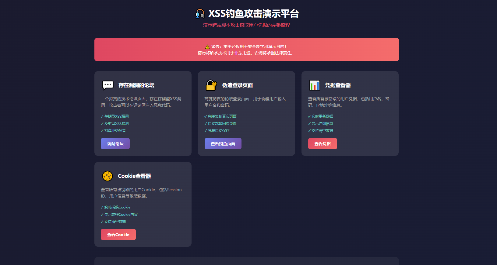
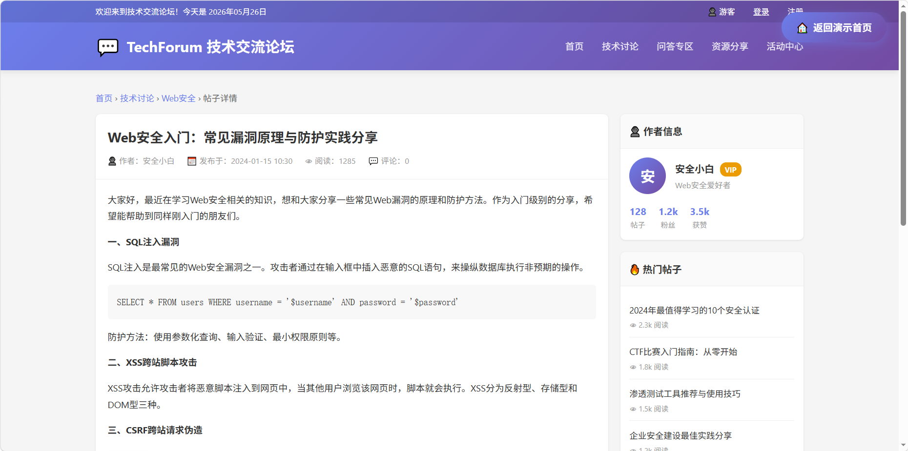
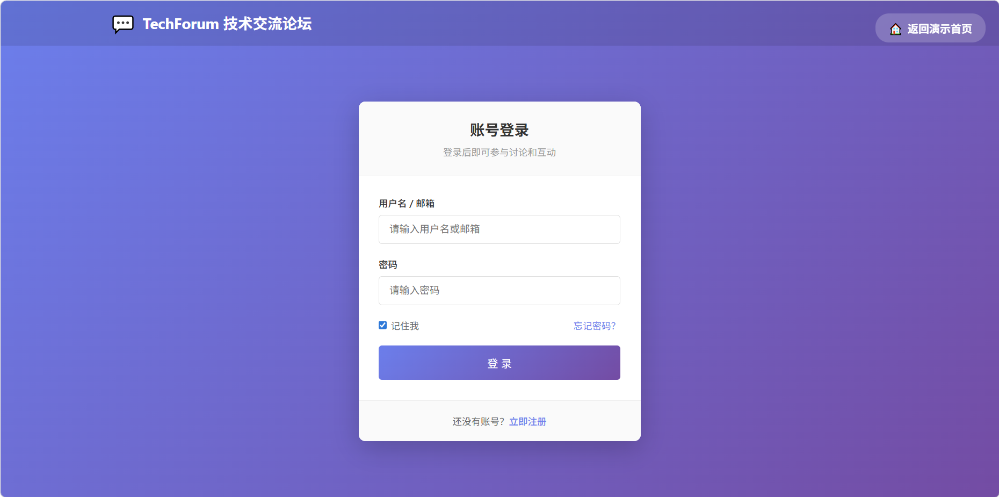
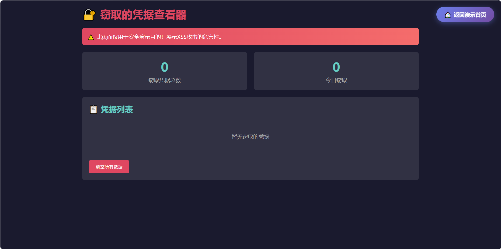

# 🎯 XSS Lab - 项目总结

## 📸 项目展示

<table>
<tr>
<td align="center"><br/><b>演示入口</b></td>
<td align="center"><br/><b>论坛页面</b></td>
</tr>
<tr>
<td align="center"><br/><b>钓鱼页面</b></td>
<td align="center"><br/><b>凭据查看</b></td>
</tr>
</table>

## 📊 项目概览

**项目名称：** XSS Lab - XSS漏洞演示靶场  
**版本：** 1.0.0  
**类型：** 网络安全教学演示平台  
**许可：** MIT License  

---

## 🎯 项目目标

创建一个完整的、拟真的XSS漏洞演示平台，用于：
- 🎓 网络安全教学
- 🔬 安全研究
- 💼 渗透测试演示
- 📚 安全意识培训

---

## ✨ 核心功能

### 1. 🎣 钓鱼攻击演示
- **拟真论坛页面** (`forum.php`)
  - 完整的论坛界面设计
  - 评论发布功能
  - 评论删除功能
  - 搜索功能
  - XSS漏洞注入点

- **钓鱼登录页面** (`phishing/login.html`)
  - 高仿真的登录界面
  - 自动跳转功能
  - 凭据窃取功能
  - 无感知的用户体验

- **凭据管理**
  - `steal.php` - 接收窃取的凭据
  - `view_credentials.php` - 查看凭据数据
  - `clear_credentials.php` - 清空凭据数据

### 2. 🍪 Cookie窃取演示
- **多种Payload类型**
  - 图片方式（推荐）
  - Script标签方式
  - Fetch API方式
  - AJAX方式

- **Cookie管理**
  - `steal_cookie.php` - 接收窃取的Cookie
  - `view_cookies.php` - 查看Cookie数据
  - `clear_cookies.php` - 清空Cookie数据

### 3. 🎮 演示控制面板
- **Payload选择器**
  - 攻击类型选择（钓鱼/Cookie窃取）
  - Payload类型选择
  - 一键注入功能
  - 一键触发功能
  - 清除功能

- **实时反馈**
  - 操作提示信息
  - 自动刷新数据
  - 状态显示

### 4. 📚 教学文档
- **完整的README**
  - 项目介绍
  - 功能特性
  - 安装指南
  - 使用说明
  - 安全警告

- **详细的教学内容**
  - XSS Payload构成解析
  - 攻击流程图解
  - 防御建议
  - 最佳实践

---

## 📁 项目结构

```
xss-lab/
├── 📄 核心文件
│   ├── demo.php                    # 演示入口页面
│   ├── forum.php                   # XSS漏洞论坛
│   ├── steal.php                   # 凭据接收脚本
│   ├── steal_cookie.php            # Cookie接收脚本
│   ├── view_credentials.php        # 凭据查看页面
│   ├── view_cookies.php            # Cookie查看页面
│   ├── clear_credentials.php       # 清空凭据
│   └── clear_cookies.php           # 清空Cookie
│
├── 📁 phishing/
│   └── login.html                  # 钓鱼登录页面
│
├── 📁 data/
│   └── .gitkeep                    # 数据存储目录
│
├── 📁 assets/
│   ├── css/                        # CSS样式目录
│   ├── js/                         # JavaScript目录
│   └── badges.html                 # 项目徽章展示
│
├── 📄 配置文件
│   ├── config.example.php          # 配置示例
│   ├── project.json                # 项目元数据
│   ├── .gitignore                  # Git忽略配置
│   └── .gitattributes              # Git属性配置
│
├── 📚 文档文件
│   ├── README.md                   # 项目说明
│   ├── QUICKSTART.md               # 快速开始
│   ├── CHANGELOG.md                # 更新日志
│   ├── SECURITY.md                 # 安全政策
│   ├── CONTRIBUTING.md              # 贡献指南
│   ├── CODE_STYLE.md               # 代码规范
│   ├── STRUCTURE.md                # 项目结构
│   ├── BADGES.md                   # 项目徽章
│   ├── CHECKLIST.md                # 上传检查清单
│   └── LICENSE                     # 开源许可证
│
└── 🐙 GitHub配置
    ├── .github/
    │   ├── ISSUE_TEMPLATE/         # Issue模板
    │   │   ├── bug_report.md
    │   │   └── feature_request.md
    │   ├── workflows/              # GitHub Actions
    │   │   └── php-check.yml
    │   └── PULL_REQUEST_TEMPLATE.md
    └── FUNDING.yml                 # 赞助配置
```

---

## 🔧 技术栈

### 后端
- **PHP 7.4+** - 服务端脚本语言
- **文件存储** - 轻量级数据存储

### 前端
- **HTML5** - 页面结构
- **CSS3** - 样式设计
- **JavaScript** - 交互逻辑

### 设计特点
- 📱 响应式设计
- 🎨 现代化UI
- 🌈 渐变色彩
- ✨ 动画效果

---

## 🎓 教学内容

### 1. XSS漏洞类型
- **反射型XSS** - 搜索功能演示
- **存储型XSS** - 评论功能演示
- **DOM型XSS** - 多种实现方式

### 2. 攻击场景
- **钓鱼攻击** - 完整的攻击链演示
- **Cookie窃取** - 会话劫持演示
- **恶意重定向** - 跳转攻击演示

### 3. Payload解析
- **代码构成** - 详细拆解每个部分
- **关键技术** - 核心技术点说明
- **完整示例** - 带注释的代码示例

### 4. 防御措施
- **输入过滤** - 输入验证方法
- **输出编码** - 输出转义技术
- **CSP策略** - 内容安全策略
- **安全配置** - 服务器安全设置

---

## 🔒 安全特性

### 安全警告
- ⚠️ 所有页面都有明显的安全警告
- ⚠️ README中包含详细的安全说明
- ⚠️ SECURITY.md中定义了安全政策

### 数据隔离
- 📁 数据文件存储在独立目录
- 🙈 Git忽略敏感数据文件
- 🔒 配置文件使用示例值

### 使用限制
- 🎓 仅用于教育目的
- 🚫 禁止用于非法用途
- ⚖️ 使用者需承担法律责任

---

## 📈 项目统计

### 文件统计
- **总文件数：** 30+
- **PHP文件：** 8个
- **HTML文件：** 1个
- **文档文件：** 10个
- **配置文件：** 5个

### 代码统计
- **总代码行数：** 约3000+行
- **PHP代码：** 约1500行
- **HTML/CSS：** 约1000行
- **JavaScript：** 约500行
- **文档：** 约1000行

### 功能统计
- **核心功能：** 8个
- **演示场景：** 6个
- **Payload类型：** 8种
- **教学文档：** 10个

---

## 🎯 适用场景

### 教育培训
- 🏫 高校网络安全课程
- 🎓 安全认证培训（CISSP、CEH等）
- 💼 企业安全意识培训
- 📚 自学网络安全

### 安全研究
- 🔬 XSS漏洞研究
- 🛡️ 防御技术开发
- 📊 安全测试工具
- 🎯 渗透测试演练

### 演示展示
- 💼 安全产品演示
- 🎤 技术会议演讲
- 📺 教学视频制作
- 🌐 在线教学平台

---

## 🚀 未来规划

### 短期目标（v1.1）
- [ ] 添加更多XSS类型演示
- [ ] 增加CSRF漏洞演示
- [ ] 添加SQL注入演示
- [ ] 优化UI/UX设计

### 中期目标（v2.0）
- [ ] 支持多用户系统
- [ ] 添加挑战模式
- [ ] 实现排行榜功能
- [ ] 支持Docker部署

### 长期目标（v3.0）
- [ ] 开发完整的漏洞靶场平台
- [ ] 支持多种漏洞类型
- [ ] 实现自动化评分系统
- [ ] 提供在线培训课程

---

## 🤝 贡献指南

### 如何贡献
1. 🍴 Fork项目
2. 🌿 创建特性分支
3. 💻 提交代码
4. 📝 创建Pull Request

### 贡献类型
- 🐛 Bug修复
- ✨ 新功能开发
- 📝 文档改进
- 🎨 UI/UX优化
- 🌍 多语言翻译

---

## 📞 联系方式

### 项目信息
- **GitHub：** https://github.com/Guojin0826/xss-lab
- **Issues：** https://github.com/Guojin0826/xss-lab/issues
- **Wiki：** https://github.com/Guojin0826/xss-lab/wiki

### 支持方式
- ⭐ Star项目
- 🍴 Fork项目
- 📢 分享给朋友
- 🐛 报告Bug
- 💡 提出建议

---

## 📜 许可证

本项目采用 **MIT License** 开源许可证。

### 许可证要点
- ✅ 商业用途
- ✅ 修改
- ✅ 分发
- ✅ 私人使用
- ❌ 责任
- ❌ 保证

### 使用限制
- ⚠️ 仅用于教育和研究目的
- ⚠️ 禁止用于非法活动
- ⚠️ 使用者需遵守当地法律

---

## 🙏 致谢

### 感谢以下项目和资源
- 🙏 OWASP - 安全知识库
- 🙏 PortSwigger - Web安全学院
- 🙏 HackerOne - 漏洞赏金平台
- 🙏 GitHub - 开源平台

### 特别感谢
- 👥 所有贡献者
- ⭐ 所有Star用户
- 📢 所有分享者

---

## 📝 最后的话

这个项目旨在帮助人们更好地理解XSS漏洞的危害和防御方法。**请务必负责任地使用这些知识，仅用于教育和合法的安全测试目的。**

**记住：**
> 🔒 安全是每个人的责任  
> 🎓 知识就是力量  
> 🤝 分享让世界更美好

**祝你学习愉快！** 🚀

---

**项目创建时间：** 2024年  
**最后更新时间：** 2024年  
**维护状态：** ✅ 活跃维护中