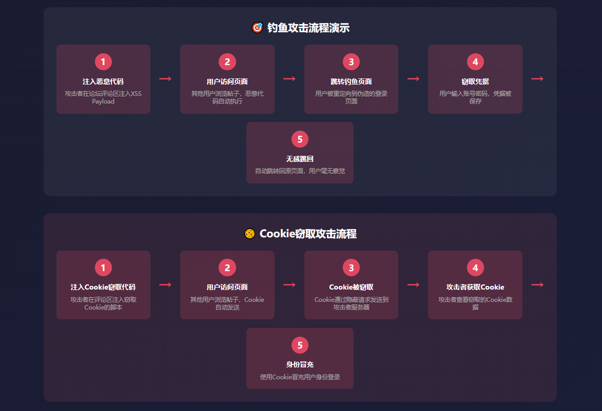
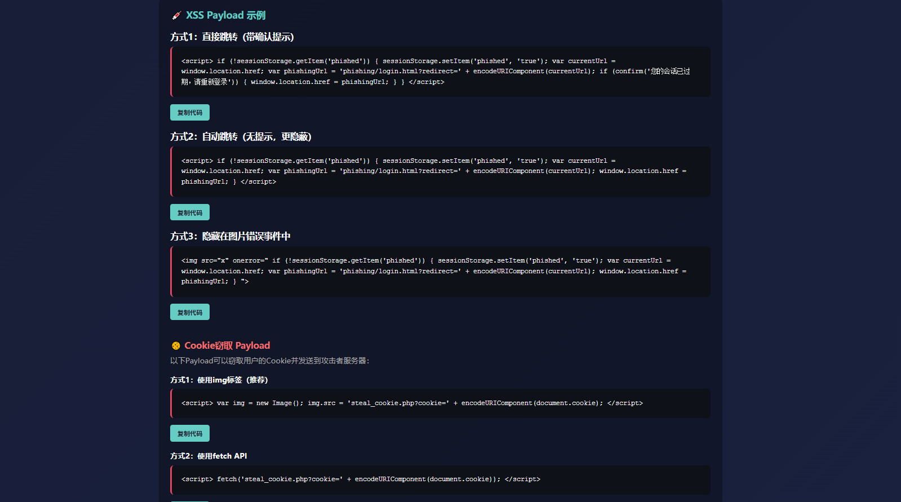

# 📸 项目截图展示

本文档展示XSS Lab项目的所有功能截图。

---

## 🎯 演示入口页面

**功能说明：**
- 完整的攻击流程说明
- 演示卡片展示（包含钓鱼平台演示）
- 快速导航链接
- 安全警告提示

---

## 📚 XSS类型演示（入门学习）

**功能说明：**
- 反射型XSS演示与原理说明
- 存储型XSS演示与原理说明
- DOM型XSS演示（四种触发方式）
- 每种类型配有测试Payload
- 防御建议和最佳实践

---

## 💬 论坛主页面

**功能说明：**
- 拟真的技术论坛界面
- 评论发布功能
- XSS演示控制面板
- 删除评论功能
- 返回演示首页按钮

---

## 🎣 钓鱼登录页面

**功能说明：**
- 高仿真的登录界面
- 用户名/邮箱输入框
- 密码输入框
- 自动跳转功能
- 返回演示首页按钮

---

## 📊 整合数据查看器

**功能说明：**
- 统一查看窃取的凭据、Cookie、键盘记录
- 标签页切换设计
- 时间戳记录
- 来源IP记录
- 自动刷新功能
- 清空数据功能
- 返回演示首页按钮

---

## ⌨️ 键盘记录演示

**功能说明：**
- 实时记录用户键盘输入
- 显示按键时间戳
- 支持清空记录
- 演示键盘记录攻击原理

---

## 💣 XSS Payload库

**功能说明：**
- 收录235+个XSS攻击向量
- 多种分类筛选（基础、进阶、绕过、特殊场景）
- 一键复制功能
- 危害等级标识（低危、中危、高危、严重）
- Payload效果说明
- 智能触发方式检测（自动、点击、悬停、输入、焦点）
- 独立测试功能
- 搜索过滤功能
- 返回主页面按钮

---

## 🧪 Payload测试页面

**功能说明：**
- 独立的Payload测试环境
- 无CSP限制，可执行任意Payload
- 支持所有类型的XSS Payload
- 实时显示测试结果
- 安全的测试沙箱
- 返回Payload库按钮
- 清除测试区域功能

**测试类型：**
- ✅ Script标签注入
- ✅ 事件处理器注入（onclick、onmouseover等）
- ✅ HTML属性注入
- ✅ SVG/MathML注入
- ✅ JavaScript协议注入
- ✅ CSS表达式注入
- ✅ DOM操作注入

---

## 🛡️ XSS防御演示

**功能说明：**
- 5种防御方法对比
- 实时演示效果
- 防御代码示例
- 效果对比表格

---

## 🎨 演示控制面板

**功能说明：**
- 攻击类型选择
- Payload类型选择
- 一键注入功能
- 一键触发功能
- 清除Payload功能

---

## 📊 攻击流程演示

**功能说明：**
- 完整的攻击流程图
- Payload构成解释
- 关键技术点说明
- 防御建议

---

## 📱 响应式设计

所有页面均支持响应式设计，适配不同设备：
- 💻 桌面端
- 📱 平板端
- 📱 移动端

---

## 🎯 使用场景

### 1. 安全教学
- 演示XSS攻击原理
- 展示攻击危害
- 讲解防御方法

### 2. 安全研究
- 测试XSS Payload
- 研究攻击技术
- 开发防御方案

### 3. 安全培训
- 员工安全意识培训
- 开发人员安全培训
- 安全测试培训

---

## ⚠️ 安全提示

**所有截图均为演示用途，请勿用于非法活动！**

- ✅ 仅用于教育和研究目的
- ✅ 在授权环境下使用
- ✅ 遵守当地法律法规
- ❌ 禁止用于非法攻击
- ❌ 禁止窃取他人信息
- ❌ 禁止造成任何损害

---

## 📞 联系方式

- **GitHub:** [@Guojin0826](https://github.com/Guojin0826)
- **Email:** jinrcsy@gmail.com

---

**最后更新：** 2025年
